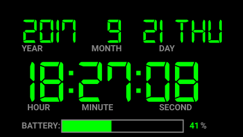

# Android Digital Clock

A simple android digital clock application which supports different screen sizes. 

The clock uses 24 hour time format and nice digital font to show the current time and the date. Additionally, it also shows current battery level visually and as a percentage. The font color is available in nine colors which change when pressing the display. 

## This is how it looks like:

